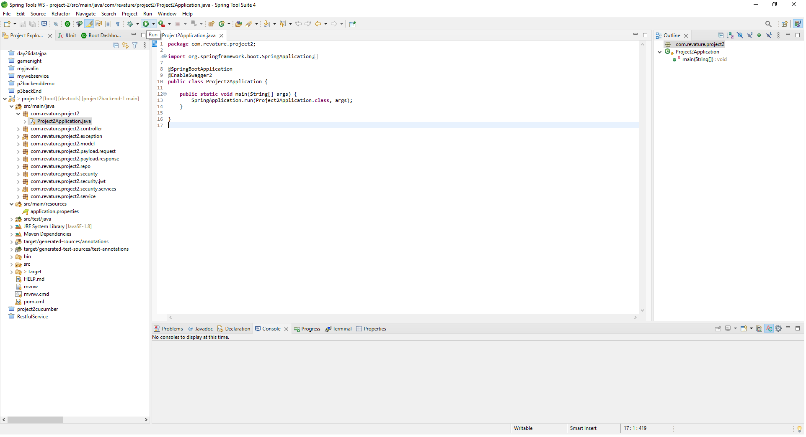
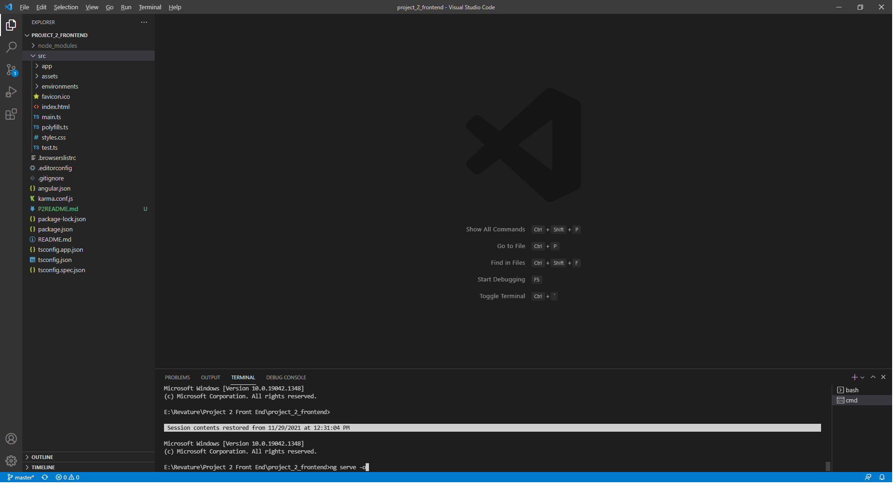
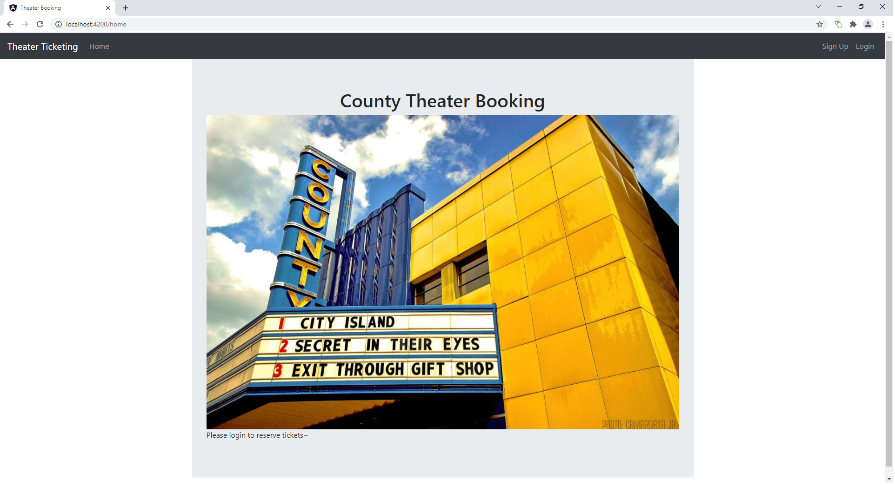
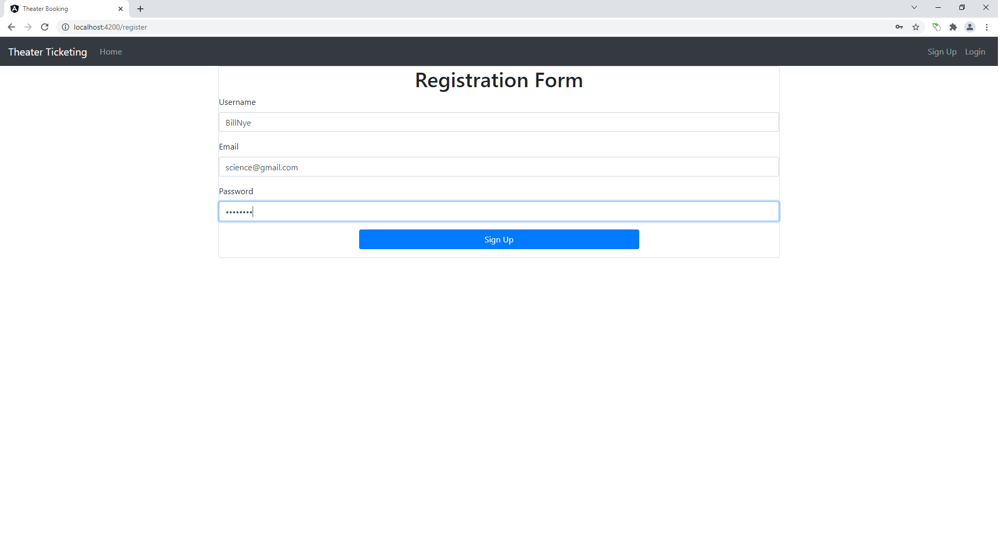
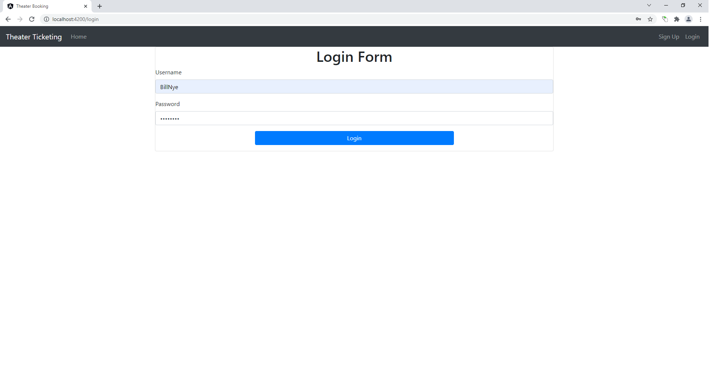
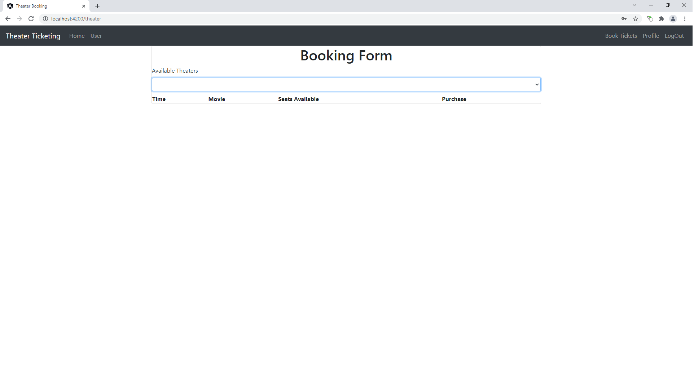
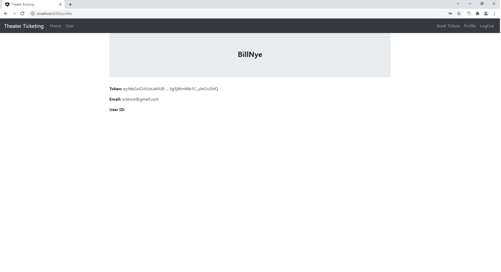

# Movie Ticketing Application

## Description

This application allows a New User to first, register an account. After registering, they can login and view available Movies and Showtimes at the local Theater. The Customer can then select a Movie to watch at their preferred time, given there are available seats for their selection.

## Technologies Used
- Java 1.8
- Angular 12.2.11
- Lombok
- PostgreSQL 42.2.24
- Maven 4.0
- JUnit4 5.6.2
- Mockito 2.21
- Selenium
- Cucumber / Gherkin

## Features
- Registration
- Login, Logout
- View Movie Selection
- View Showtimes for each Movie
- Get tickets for selected Movie at the selected Showtime

### To-do List
- Reset password feature
- Complete profile feature
- Refund purchase feature

## Getting Started
1. Fork the repository: https://github.com/delujan/project2-MovieApp.git
2. Navigate to desired folder location on local machine
3. Run Git Bash from this location
4. Clone the forked repository: git clone yourForkedRepositoryName
5. Open Spring Boot IDE (preferred) and import the backend portion of the project from the 'backend' branch
6. Open VS Code (perferred) and open the frontend portion of the project
7. If Angular is not installed, run the command on the CLI: npm install -g @angular/cli
8. Start the backend portion by navigating to Projet2Application.java, right-click and select 'Run as Spring Boot App'
6. Start the frontend portion in VS Code by using the CLI command: ng serve --open
10. Navigate to localhost:4200 on desired web browser
11. Register an account. (or follow step 12)
12. Login with your created credentials (from step 11) or use the following credentials:  
Customer Login:  email = test@gmail.com | password = test123  

## Usage
Start both the backend and front end of the application:

  

Open a browser of your choice and navigate to: localhost:4200

Register an account:

Login to the newly created account:

Booking page:

Profile page:

## Contributors
Steven Salmeron: Handled the BackEnd code  
Andrew Durkin: Handled the FrontEnd code  
David Lujan(Myself): Handled the Testing code  
